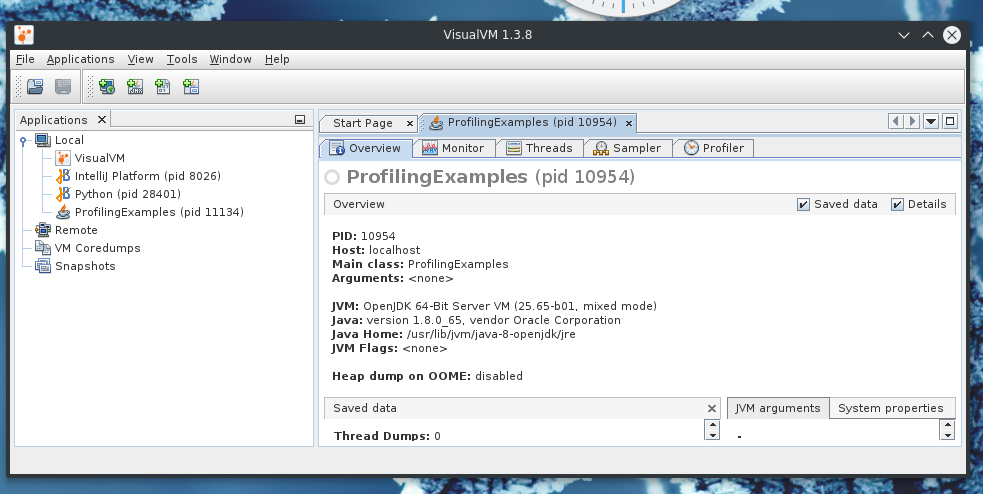

# Profiling the JVM with VisualVM

## About VisualVM

VisualVM is a profiling tool, it let's you see what programs running on the JVM are doing.

    * How much time is spent in what method call / class
    
    * Where memory is spent

Developers can monitor what their code is doing.

Admins can monitor what JVM programs are doing in their network.

End users can submit bug reports with helpful information.

Link: [https://visualvm.java.net/](https://visualvm.java.net/)

## How to use

### Overview

You will need to run a java program, then connect to it in VisualVM. 

Then once you are done profiling, you can either stop the profiler or wait for the program to finish.

As an example here in this repo, there is a ProfilingExamples.java file, to run it:

```

javac ProfilingExamples.java

java ProfilingExamples

```

It will run 4 functions with the same input (2000, but you can set it yourself in ProfilingExamples.java to test things out. 
NOTE: Cubic will run VERY long even with "small values").
These functions will have very different performance, from O(n) (constant) to O(n^3) (cubic). We will see this reflected in the profiling results.

### The step by step

Opening up VisualVM, you will get a similar screen to this:



In the left hand menu all the programs running on the JVM will be shown:


Selecting one of them will show information about the process and the tab of interest at first will be profiler:


Within the profiler view, profiling the CPU will be of interest at first:


After clicking CPU, let the program finish and VisualVM will ask you if you want to save a snapshot, click yes. You should get something like this in the results:


As we can see, we get the info that under the main method, 4 other methods were called. This is as you would expect from the code. 
You are given the total time each method took in % and ms and you can also see how many Invocation of the method happened.

The drastic difference between different complexity algorithms is well displayed here.

Note: Ignore the Thread0 and DestroyVM calls, those are just regular JVM processes.

## Extra:

### Good to know

    * Know that you can profile memory as well, to see how much memory what component are using.
    
    * Under CPU profiling you can also change the View from Methods to Classes, to get a higher level overview.
    
    * You can also open the Monitor tab and see general statistics about the performance of the JVM program:
    


### Interesting example of dead code elimination in the JVM

If you make the following changes in the cubic method:

```
    public static int cubic(int n) {
    
        int sum = 0;
        
        for (int j = 0; j < n; j++) {
        
            for (int k = 0; k < n; k++) {
            
                for (int l = 0; l < n; l++) {
                
                    // sum += j * k / (l + 1); Replace this with..
                    
                    sum += j; //.. this
                    
                }
                
            }
            
        }
        
        return sum;
        
    }
```

The inner process (sum += j;) no longer uses the values from the other loops (k and l), thus they are "Dead Code". The 
JVM replaces looping over the values and adding with something like multiplication as the exact value of k and l have no consequence.

```
for j -> n

    for k -> n
    
        for l -> n
        
            sum += j
            
```

becomes:

```
for j -> n

    sum += j
    
sum = sum * n * n

```

The results:

#### Original


#### Edited cubic method

